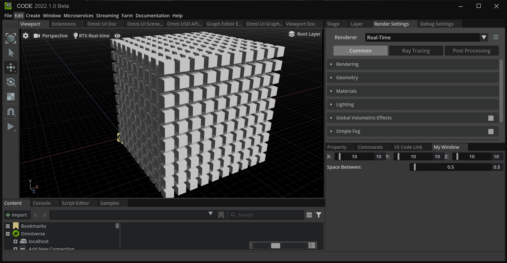

# Cube Array Sample Extension

## Adding This Extension

To add a this extension to your Omniverse app:
1. Go into: Extension Manager -> Gear Icon -> Extension Search Path
2. Add this as a search path: `git://github.com/True-VFX/kit-ext-cube_array.git?branch=main&dir=exts`

## Using This Extension

1. Click the large 'Creat Array' button. This will add an xform object to your stage
2. Mess with the X, Y, and Z values to determine how many cubes in each axis to create
3. Play with the Space Between to add more or less space between each cube
